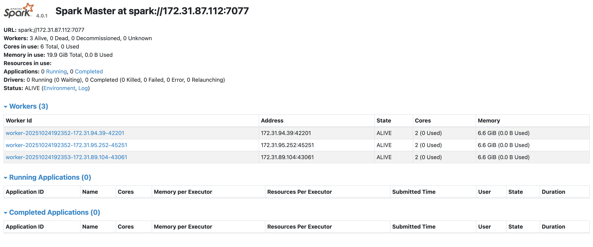
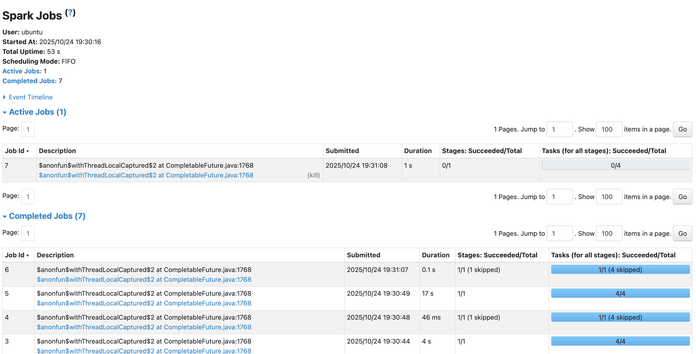
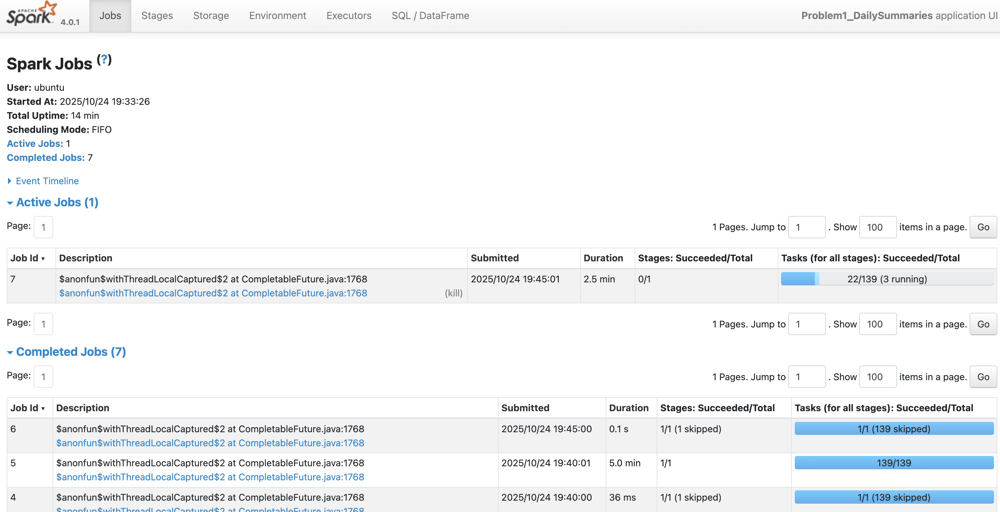
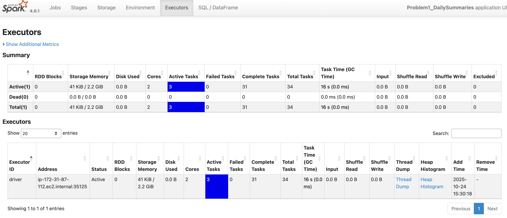
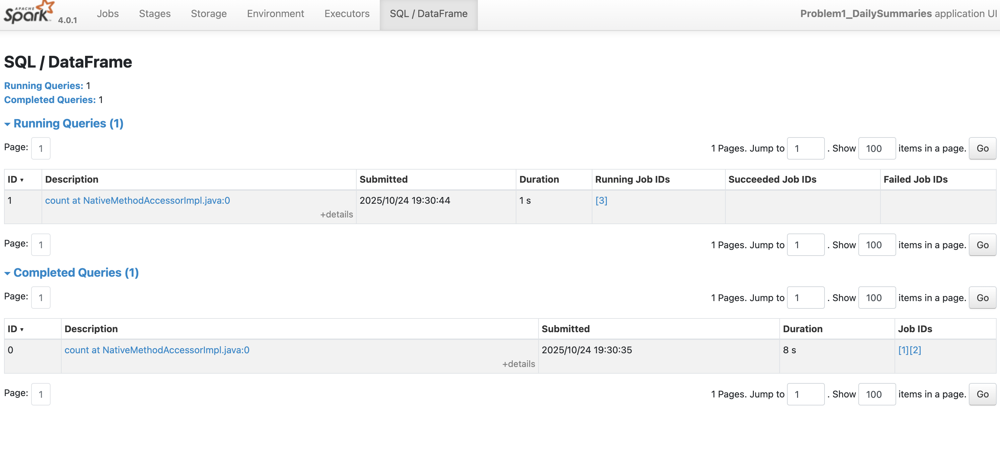
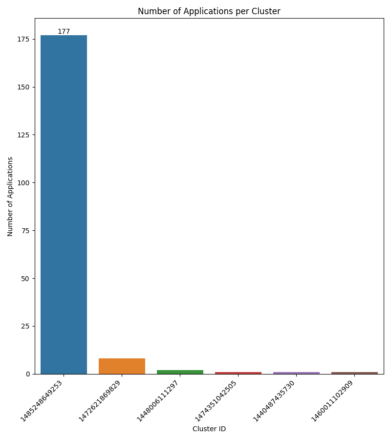
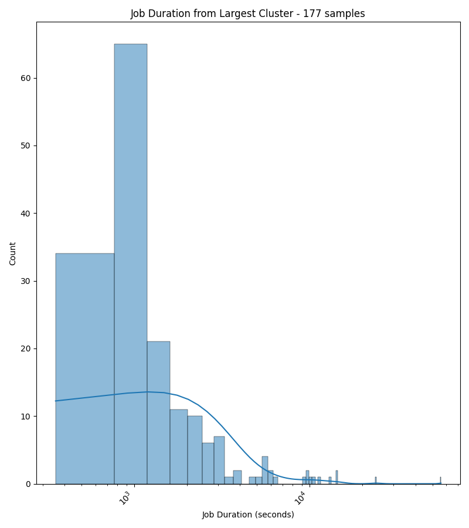

# Analysis Report

## Problem 1 approach:
This problem was less about the summaries and rather just trying to read in the data properly from the logs and then figuring out how to parse it once it was in. I also was trying to plan ahead and add in the application_id and container_id (though container id was not needed). I was originally having issues with the first file in the application, but I was able to filter that file out entirely. Then I realized that the lines with 'SLF4J' were cause me to not be able to parse the logs, and I had to filter those lines out. After that, using pyspark wasn't difficult to get the requested summaries. I did have to change my approach to how to get the application_id, I was reading the application and container_ids, by container, but I changed it to by application since that was taking too much computing power. I also learned about the 'input_file_name' function, which meant I didn't have to record the ids while I was reading in the dataframes, I could do it after.

## Problem 2 approach:
I ended up doing most of the heavy lifting in the first problem with getting the application and container ids, but I did realized I need the cluster_ids as well for problem two. I just got the container ids the same way I did the application ids. From there is was just using pyspark and summary stats. I created the duration column while still in the spark dataframe though, rather than in pandas. And then once I converted to pandas, I subsetted for the largest cluster to get that smaller dataframe. The seaborn visuals were created with the panadas dataframes. 

## Key Findings from the Data:
The hardest part about this kind of data was that it was text files that had to read read in line by line and there was a lot of non-uniformity in the text and that so much value was derived from the file names. It was a good lesson in understanding you data structures and input data. The data literacy page was also important when trying to understand the logs itself. 

## Performance Observations:
I did have to optimize my code at one point during problem one because it was taking too much computing power and time (~40 min and still not done). I found the input_file_name function and that allowed me to not have to read in the spark dataframes by container. I did maintain the application level read in so that I could control testing more. That would be a further optimization if needed. 

## Spark Web UI

## Explanation of Visualizations

This bar chart shows that over 90% of the applications were completed on one of the 6 clusters. All the other clusters had minute numbers of applications compared to the largest cluster. 

This density plot shows that most of the jobs were completed in under 1000 seconds but there were a few jobs that greatly exceed that timeline, especially considering that it is a log scale. Quite a few jobs took exponentially longer than the majority of the jobs. 